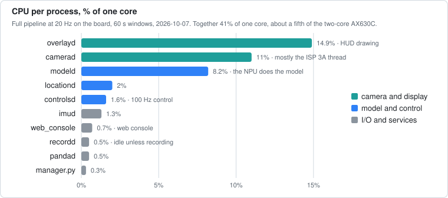

# edgepilot · MaixCAM2

<table>
  <tr>
    <td width="50%" align="center" valign="top"><br><sub><b>Day</b>: about 60 km/h behind a lead car, from a straight into a 250 m right-hand curve</sub></td>
    <td width="50%" align="center" valign="top"><br><sub><b>Night</b>: about 77 km/h under overpasses, from a straight into a 240 m right-hand curve</sub></td>
  </tr>
</table>

<p align="center">
  <strong>openpilot perception and lateral control, native on a Sipeed MaixCAM2 (AX630C)</strong><br>
  KIA K7 YG HEV · supercombo on the AX630C NPU · Panda USB/CAN · 640x480 driving HUD<br>
  <sub>Both clips are recorded drives steering in lane mode, with the HUD redrawn from the logged model,
  control and learner states by the runtime's own renderer, as <code>overlayd</code> shows it on the
  board's screen. The board load card holds typical values; the recording does not log them.</sub>
</p>

| Board | Vehicle | Model | Control | Runtime |
| --- | --- | --- | --- | --- |
| Sipeed MaixCAM2 (AX630C, 1 GB) | KIA K7 YG HEV | openpilot master supercombo (Pulsar2 axmodel) | lateral (LKAS torque) | C++17 split processes |

edgepilot runs openpilot's driving model and lateral control on small embedded
boards. This `main` branch targets the MaixCAM2; the [`k230`](../../tree/k230)
branch keeps the earlier Kendryte K230 port.

> [!WARNING]
> This is experimental vehicle-control software. Keep Panda safety enabled, run
> in shadow mode first, and validate every change in a controlled environment
> before road use.

## Highlights

- **supercombo on the AX630C NPU.** The openpilot master `driving_supercombo`
  core, compiled with Pulsar2 6.0 (U16 activations, uint8 image inputs), runs in
  about 15.5 ms on one NPU core (the other core runs the AI-ISP denoiser); a
  whole `modeld` frame is about 19.5 ms, inside the 20 Hz budget. The history queues the released ONNX keeps in-graph
  (images, desire, features) run on the CPU in `src/model/model_temporal.h`.
- **Hardware all the way to the model.** The camera frame goes into a CMM
  (physically contiguous) frame ring by IVPS copy; the GDC warps it straight
  from there into both model views, and IVPS scales it onto the LCD. No process
  touches camera pixels on the CPU.
- **openpilot's lateral stack in C++.** Lane planner, lateral MPC, torque
  controller, and online camera calibration, with no openpilot checkout, Python
  native extension, or Qt on the board. The in-tree MPC solver replaces acados.
  Ports of paramsd and torqued estimate the steer ratio and torque response
  while driving, and the controller uses them.
- **K7 YG HEV integration.** `LKAS11` and `MDPS12` at 100 Hz, `CLU11` at 50 Hz,
  the 60 kph MDPS speed helper, and a torque ramp that cuts the request before
  the MDPS fault angle.
- **Vision cruise.** The vision lead nudges the stock fixed-speed cruise setpoint
  with `SET-`/`RES+` pulses. There is no longitudinal actuation.
- **Driving HUD.** Plan, lanes, road edges, and lead over the camera preview on
  the 640x480 LCD, drawn at 20 Hz on a hardware overlay layer, with status
  panels and stop-and-go departure alerts (on screen and on the board speaker).
- **Replay and tune.** Host tools replay a recorded drive open- or closed-loop,
  and a web parameter editor pushes changes the controller picks up within
  100 ms.
- **Tested off the board.** The control and perception libraries build on
  macOS or Linux, with a googletest suite (196 tests) that needs neither the
  board nor its SDK.

## How it works

### The pipeline

<p align="center"></p>

Each process does one job and talks to the others through `/dev/shm`, keeping
openpilot's process boundaries without Cap'n Proto/cereal. Camera pixels never
pass through the CPU: the frame ring lives in physically contiguous memory, the
GDC warps it straight into both model views, and IVPS scales it onto the LCD and
copies it for the recorder. `manager.py` starts and supervises the processes,
the web console (`web_console/`) serves the tuning UI, and `recordd` logs every state next to
the H.264 video. See [Split runtime](docs/runtime.md) for each process.
`scripts/install_autostart.sh` installs a systemd unit that starts the runtime at
boot in place of the stock launcher.

### One frame, end to end

<p align="center"></p>

### Lateral control

<p align="center"></p>

On a recorded minute of engaged lane keeping, the car's measured curvature (from
the steering angle and yaw rate) follows what the controller asks for closely:

<p align="center"></p>

### What it costs the board

<p align="center"></p>

## The HUD

`overlayd` draws the HUD at 20 Hz on the display's hardware overlay layer, above
the camera preview. These states are rendered off-line with
[`hud_snapshot`](diagnostics/README.md), the same renderer the board runs:

<table>
  <tr>
    <td width="33%" align="center" valign="top"><br><sub><b>Engaged</b>: path, lead distance and closing speed, lane position</sub></td>
    <td width="33%" align="center" valign="top"><br><sub><b>Lane change</b>: blinker on, steer to start once safe</sub></td>
    <td width="33%" align="center" valign="top"><br><sub><b>Green light</b>: departure alert while held at a stop</sub></td>
  </tr>
  <tr>
    <td width="33%" align="center" valign="top"><br><sub><b>Take control</b>: the turn needs more torque than allowed</sub></td>
    <td width="33%" align="center" valign="top"><br><sub><b>Steering paused</b>: the driver turned the wheel past 85°; steering resumes below 15°</sub></td>
    <td width="33%" align="center" valign="top"><br><sub><b>Steering fault</b>: the MDPS reports a fault</sub></td>
  </tr>
</table>

Alerts also play on the board speaker. Tapping the status pill opens a network
card, and tapping the left column toggles a diagnostic card.

## Safety model

Every layer must agree before steering torque reaches the car:

<p align="center"></p>

1. **`controlsd` gates** require a fresh model, a valid MPC solution, fresh
   vehicle state, the right gear, a fastened seatbelt, and an explicit driver
   SET press. A failing gate shows its reason on the HUD.
2. **Controller limits** cap the curvature at openpilot's `0.2 1/m` with a jerk
   limit, rate-limit the torque, and ramp it to zero before the MDPS fault angle.
3. **`EDGEPILOT_PANDA_TX`** is the final transmit switch; the controller never
   transmits on its own. On the MaixCAM2 the manager starts `pandad` only
   with `EDGEPILOT_ENABLE_PANDA=1`.
4. **Panda safety firmware** (`hyundaiCommunity`) enforces the Hyundai torque,
   rate, and driver-override limits and is never bypassed.

## Hardware

<p align="center"></p>

- Sipeed MaixCAM2 (AX630C: 2x Cortex-A53 + NPU, 1 GB), with its stock
  `ov_os04d10` camera and 640x480 LCD, on the stock image (Ubuntu 22.04 arm64,
  AX runtime in `/opt/lib`, `libmaixcam_lib` 1.2.5)
- a comma Panda on the USB-C port (the manager switches it to host mode)
- a KIA K7 YG HEV

The MaixCAM2 has a single USB-C port, so a Panda setup needs power from another
source.

## Getting started

1. **Prepare the board.** See [Board setup](docs/board-setup.md) for SSH, the
   web console packages, and the rootfs caveats.
2. **Build.** Fetch the SDK and the board libraries once, then build in an
   arm64 Ubuntu 22.04 container
   ([details](docs/build-and-deploy.md)):

   ```sh
   scripts/fetch_maixcam2_sdk.sh root@192.168.219.117
   tools/docker_ax630/build.sh          # -> build-ax630/bin
   ```

3. **Upload.** The model (`models/supercombo.axmodel`, built with
   [tools/model/axmodel](tools/model/axmodel/README.md)) is in the repository and
   is sent only when it changed:

   ```sh
   scripts/upload_to_board.sh root@192.168.219.117
   scripts/install_autostart.sh root@192.168.219.117   # also sets maix_npu_ai_isp=1
   ```

4. **Run.** On the board:

   ```sh
   python3 /root/edgepilot/manager.py
   ```

   The manager stops the stock launcher first. Tune parameters at
   `http://<board-ip>:8080`.
5. **Shadow run first.** Verify Panda RX, safety mode, and counters with TX off
   before enabling it; the gates are listed in
   [K7 Panda port](docs/k7-panda-port.md).

## Development

```sh
./scripts/run_host_tests.sh    # build and run every host unit test through ctest
```

- [Host unit tests](tests/README.md): what each test covers and how to add one
- [Diagnostic tools](diagnostics/README.md): replay, dataset, and HUD tools
- [Rehearsal](docs/rehearsal.md): replay a recorded drive through the whole runtime
  on the board (hardware H.264 decode into the frame ring, CAN on the same timeline)
- [Camera calibration](docs/camcal.md): measure the camera intrinsics with a TV checkerboard and the Func button
- [Closed-loop replay](docs/closed-loop-replay.md): rank control changes against
  a recorded drive before driving them
- [Scripts](scripts/README.md): build, deploy, and the board-side Python

## Repository layout

```text
src/            runtime code, one folder per subsystem (docs/source-layout.md)
platform/       MaixCAM2 camera (VI), display (VO), CMM, and GDC wrappers
params/         runtime parameters, hot-reloaded by the processes
models/         the axmodel and its manifest
firmware/       the Panda firmware (firmware/panda)
tests/          host unit tests and the Python layout checks
diagnostics/    replay, dataset, and HUD tools
scripts/        SDK fetch, deploy, host tests, board-side Python
tools/          axmodel pipeline, camera calibration, build container, route readers
docs/           documentation; docs/images holds the README media
```

## Documentation

- **Setup:** [Board setup](docs/board-setup.md) · [Build and deploy](docs/build-and-deploy.md) ·
  [Boot time](docs/boot-time.md) · [Panda firmware](firmware/panda/README.md)
- **How it works:** [Split runtime](docs/runtime.md) · [Model pipeline](docs/model-pipeline.md) ·
  [Model package](models/README.md) · [Source layout](docs/source-layout.md)
- **Operating:** [Runtime options](docs/runtime-options.md) · [Parameters](params/README.md) ·
  [Diagnostics](docs/diagnostics.md) · [Verification](docs/verification.md)
- **Design notes:** [K7 Panda port](docs/k7-panda-port.md) · [Departure alerts](docs/departure-alerts.md) ·
  [Closed-loop replay](docs/closed-loop-replay.md)

## Acknowledgements

- [openpilot](https://github.com/commaai/openpilot) by comma.ai: the supercombo
  model, and the planner, MPC, calibration, and parameter estimators this
  runtime ports
- [panda](https://github.com/commaai/panda) by comma.ai: the CAN interface, and
  the firmware in `firmware/panda` (MIT), by way of crwusiz's openpilot import
- [MaixCDK](https://github.com/sipeed/MaixCDK) by Sipeed: the MaixCAM2 MSP SDK
  and `libmaixcam_lib` headers
- Pulsar2 by Axera: the AX630C NPU compiler
